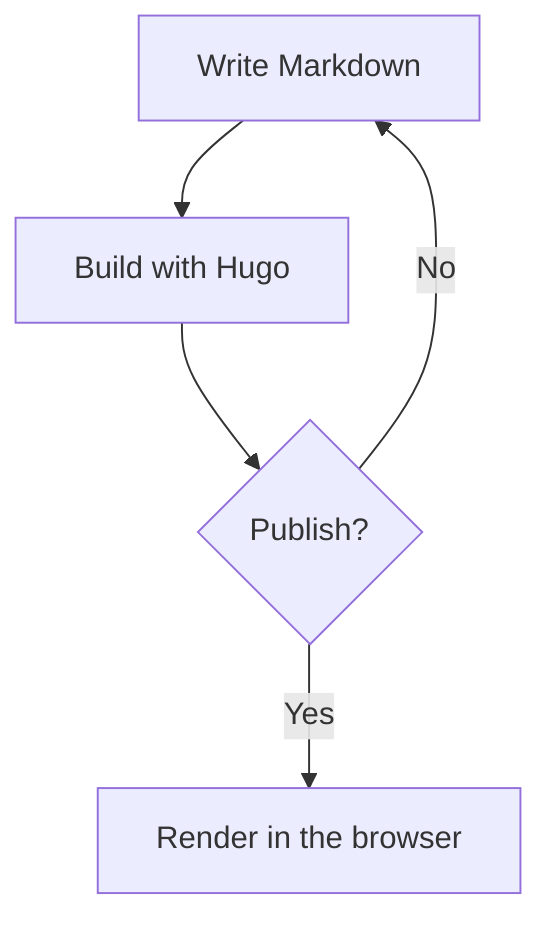
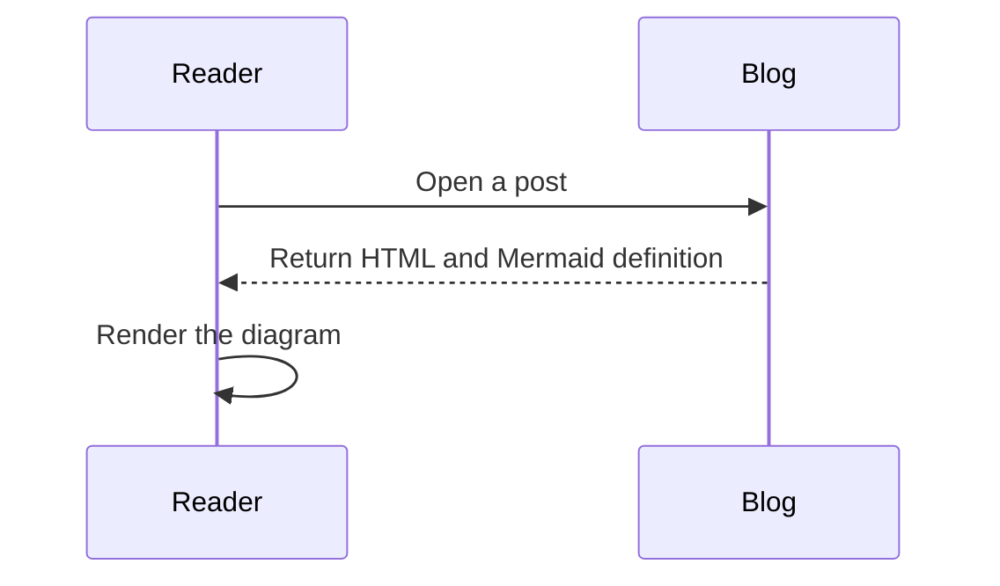
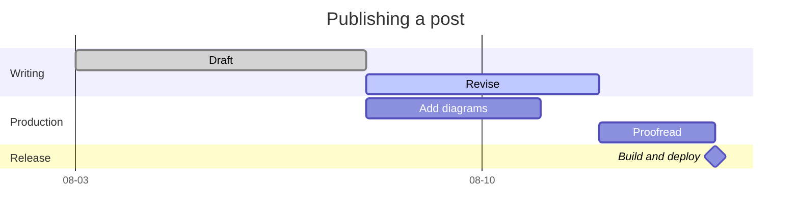
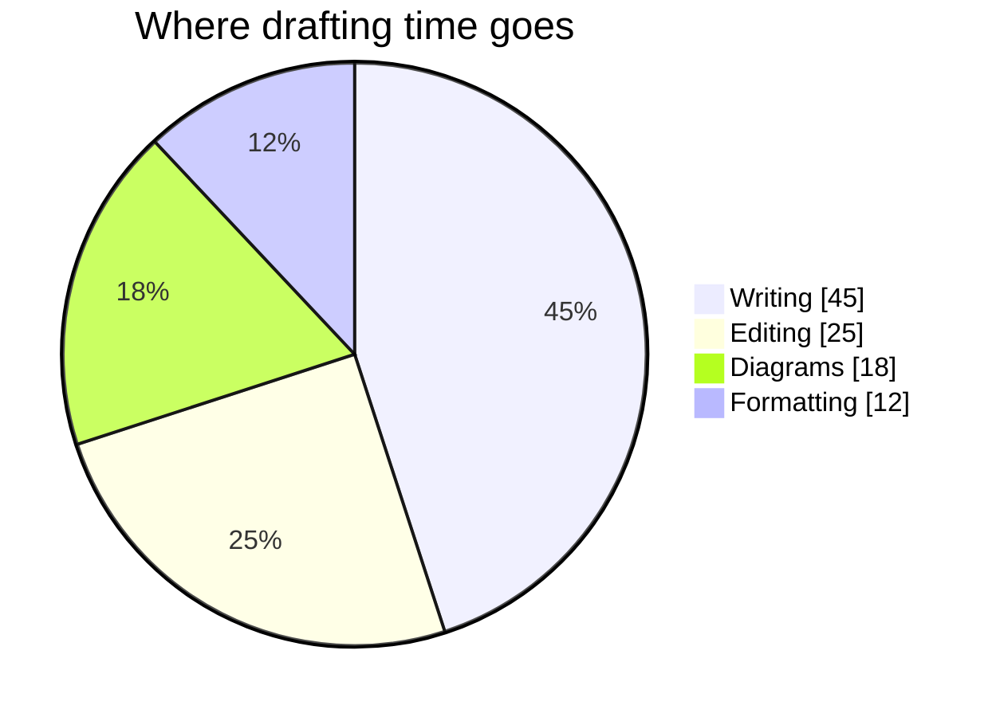

Mermaid diagrams can be written directly in Markdown with a fenced `mermaid` code block. Hugo keeps the diagram definition in the page, and the browser renders it when the page loads.

<!--more-->

## Flowchart

Use a flowchart to show a process or decision:

## Sequence diagram

Use a sequence diagram to show messages exchanged over time:

## Gantt chart

Use a Gantt chart to place work on a calendar and show what overlaps:

`dateFormat` describes the dates written in the definition, and `axisFormat` describes the labels drawn on the axis. `tickInterval` controls how often those labels appear — leave it out on a multi-week chart and the daily ticks collide. Tasks chain with `after <id>`, so shifting one task moves everything downstream of it.

## Pie chart

Use a pie chart for a small number of parts that add up to one whole:

`showData` prints the raw values next to the legend. Keep the slice count low — beyond five or six parts a table reads better than a circle.

Only pages containing a `mermaid` fence load the Mermaid module, regardless of how many diagrams the page contains.
