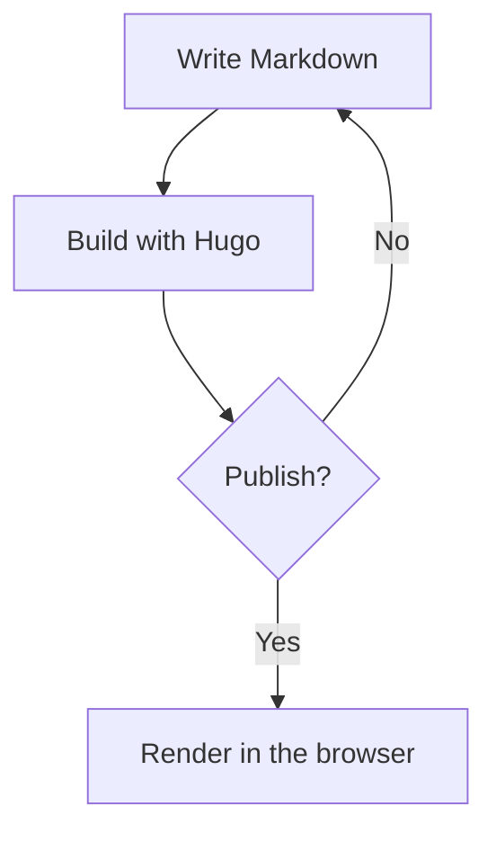
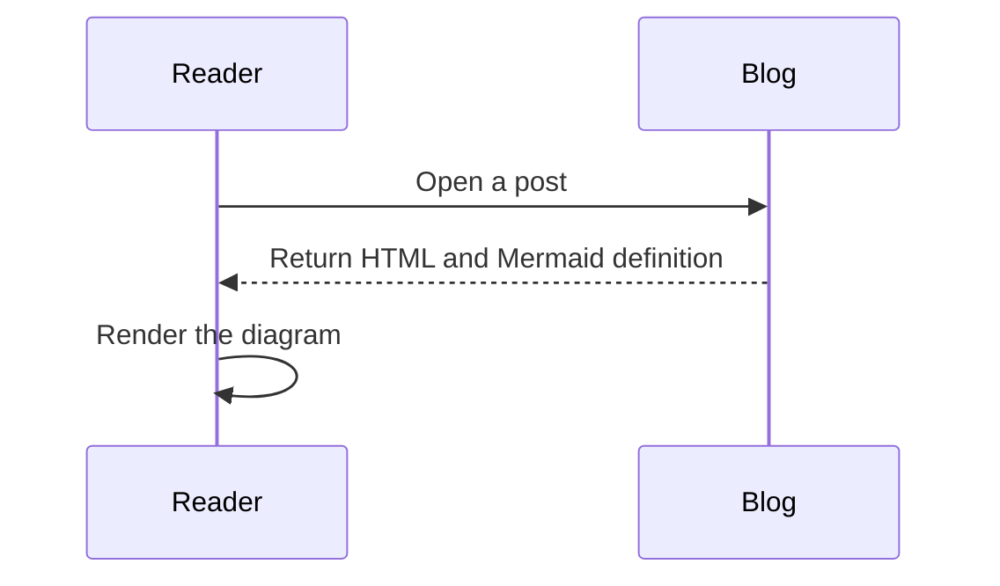

Mermaid diagrams can be written directly in Markdown with a fenced `mermaid` code block. Hugo keeps the diagram definition in the page, and the browser renders it when the page loads.

<!--more-->

## Flowchart

Use a flowchart to show a process or decision:

## Sequence diagram

Use a sequence diagram to show messages exchanged over time:

Only pages containing a `mermaid` fence load the Mermaid module, regardless of how many diagrams the page contains.
